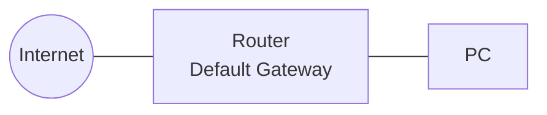

# CCNA ITN Labs — Introduction to Networks


# CCNA ITN Labs — Introduction to Networks


**Course:** Networks and Protocols (NP) — CCNA ITN  
**Instructor:** Prof. Dr. A. Grebe  
**Institution:** TH Köln

---

## Repository Structure

```
ccna-itn-labs/
├── README.md                            ← you are here
├── lab1-simple-network-arp-internet/    ← Lab 1: Simple Network, QoS Metrics, Internet Access
├── lab2-ipv4-ipv6-router-switch/        ← Lab 2: IPv4/IPv6 LAN, Router & Switch Config
└── lab3-tcp-udp-static-routes-ssh/      ← Lab 3: TCP/UDP/DNS, Static Routes, SSH Security
```

---

## Lab Overview

| Lab | Topics | Devices |
|-----|--------|---------|
| Lab 1 | Simple Network, ICMP/ARP, Wireshark, QoS Delays | PC-A, PC-B, S1, S2 |
| Lab 2 | Subnetting, IPv4/IPv6, Router & Switch IOS config | R1, S1, PC-A, PC-B |
| Lab 3 | TCP 3-Way Handshake, DNS/UDP, Static Routes, SSH | R1, R3, S1, PC-A, PC-C |

---

## Overall Network Topology (Lab 1 — Task 2 / Labs 3)



---

## Prerequisites

- Cisco IOS switches (e.g. Catalyst 2960) and routers (e.g. ISR 4321)
- PuTTY or similar terminal emulator for console/SSH access
- Wireshark for packet capture labs
- Rollover (console) cable + USB-to-serial adapter
- Ethernet patch cables

---

## Common IOS Quick Reference

```
enable                          ! enter privileged EXEC
configure terminal              ! enter global config
hostname <name>                 ! set device name
no ip domain-lookup             ! disable DNS lookup
enable secret <password>        ! encrypted privileged password
service password-encryption     ! encrypt all plaintext passwords
banner motd # <message> #       ! message-of-the-day banner
copy running-config startup-config  ! save config
show running-config             ! display current config
show ip interface brief         ! interface status summary
show ip route                   ! IPv4 routing table
```
<<<<<<< HEAD
## ccna-itn-labs
=======
# ccna-itn-labs
# ccna-itn-labs
>>>>>>> dd1ad32 (first commit)
