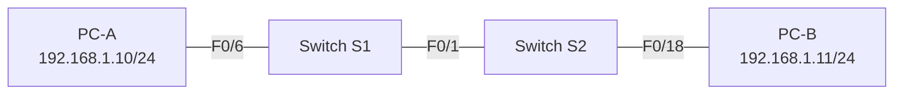
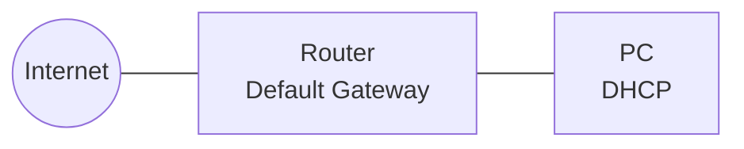

# Lab 1 — Simple Network, Network QoS Metrics, Internet Access Analysis

**Topics:** Simple Network Setup · ICMP Connectivity · ARP Analysis · Wireshark · QoS Delay Calculations · Internet Traffic Analysis

---

## Topology

### Task 1 — Simple LAN (Two PCs, Two Switches)



### Task 2 — Internet Access via Router



---

## Addressing Table — Task 1

| Device | Interface | IP Address   | Subnet Mask   | Default Gateway |
|--------|-----------|-------------|---------------|-----------------|
| PC-A   | NIC       | 192.168.1.10 | 255.255.255.0 | N/A             |
| PC-B   | NIC       | 192.168.1.11 | 255.255.255.0 | N/A             |

---

## Lab Preparation — Key Answers

### Network Delay Calculations

**Propagation delay** formula: `t_pd = d / v`  
Signal speed in Cat5e: `v = (2/3) × c₀ = (2/3) × 3×10⁸ m/s = 2×10⁸ m/s`

| Link | Distance | Propagation Delay |
|------|----------|-------------------|
| DN Lab Cat5e (55 m) | 55 m | `55 / 2×10⁸ = 0.275 µs` |
| TH Köln → Berlin fiber (600 km) | 600,000 m | `600,000 / 2×10⁸ = 3 ms` |

**Transmission time** formula: `t_t = L / R`  
Data rate: `R = 100 Mbps = 100×10⁶ bps`

| Frame Size | Transmission Time |
|------------|-------------------|
| 64 Bytes (min) | `(64×8) / 100×10⁶ = 5.12 µs` |
| 1518 Bytes (max) | `(1518×8) / 100×10⁶ = 121.44 µs` |

### Windows / Linux IP Commands

| Task | Windows | Linux |
|------|---------|-------|
| Set IP + mask | `netsh interface ip set address` | `ip addr add <ip>/<prefix> dev <iface>` |
| Show all IP settings | `ipconfig /all` | `ip addr` or `ifconfig` |
| Test reachability | `ping` | `ping` |
| List routers in path | `tracert` | `traceroute` |
| Show all sockets | `netstat -an` | `ss -an` or `netstat -an` |
| DNS name → IP | `nslookup` | `nslookup` or `dig` |

### Ethernet II Frame Structure

| Field | Preamble | Dst MAC | Src MAC | EtherType | Data | FCS |
|-------|----------|---------|---------|-----------|------|-----|
| Size  | 8 B (not shown in WS) | 6 B | 6 B | 2 B | 46–1500 B | 4 B (stripped by NIC) |

- **Header size:** 6 + 6 + 2 = **14 bytes**
- **Trailer size:** **4 bytes** (FCS)
- Frame of 1320 B displayed in Wireshark: `1320 − 4 = **1316 bytes**` (FCS stripped by NIC before capture)

### ARP

- **ARP function:** Maps a Layer 3 IP address to a Layer 2 MAC address dynamically on a LAN.
- **ARP Request destination MAC:** `FF:FF:FF:FF:FF:FF` (broadcast) — must reach all devices since the target MAC is unknown.
- **ARP Response source MAC:** The MAC address of the device that owns the queried IP address.

### ICMP Types

| Type | Code | Meaning |
|------|------|---------|
| 8 | — | Echo Request (ping) |
| 0 | — | Echo Reply |
| 11 | — | Time Exceeded (TTL expired — used by traceroute) |
| 3 | 0 | Destination Unreachable: Network Unreachable |
| 3 | 1 | Destination Unreachable: Host Unreachable |
| 3 | 3 | Destination Unreachable: Port Unreachable |
| 3 | 4 | Destination Unreachable: Fragmentation Needed |

> **Why ARP before first ping?** The sender knows the destination IP but not its MAC address. Without the MAC it cannot build an Ethernet frame. ARP resolves the MAC first; the result is cached for subsequent pings.

---

## Task 1 — Step-by-Step Instructions

### Part 1: Physical Setup

1. Power on all devices.
2. Connect **S1 F0/1 ↔ S2 F0/1** with a patch cable (link LEDs go amber → green).
3. Connect **PC-A NIC → patch panel port 1 → S1 F0/6**.
4. Connect **PC-B NIC → patch panel port 3 → S2 F0/18**.

### Part 2: Configure Static IP on PCs

**PC-A (Windows example):**
```
netsh interface ip set address "Local Area Connection" static 192.168.1.10 255.255.255.0
```

**PC-B (Windows example):**
```
netsh interface ip set address "Local Area Connection" static 192.168.1.11 255.255.255.0
```

**Verify on each PC:**
```
ipconfig /all
```

### Part 3: Test Connectivity

```
ping 192.168.1.11      ! from PC-A → PC-B
ping 192.168.1.10      ! from PC-B → PC-A
```

Expected RTT in this lab segment: **< 1 ms** (dominated by switch processing/queuing delay, not propagation).

---

## Task 2 — ARP and Internet Traffic

### Part 1: ARP Cache

```
arp -a                  ! Windows: display ARP cache
arp -d *                ! Windows: flush entire ARP cache (admin shell)
netsh interface ip delete arpcache   ! alternative flush
```

**Linux equivalents:**
```bash
ip neigh show           # display ARP/neighbor cache
ip neigh flush all      # flush cache
```

### Part 2: Internet Web Access — Protocol Sequence

When opening `http://www.dn.th-koeln.de` for the first time (clean caches):

```
ARP  →  DNS  →  HTTP
```

1. **ARP** — resolve default gateway MAC (needed to send any frame off-LAN)
2. **DNS** — resolve `www.dn.th-koeln.de` → IP address
3. **HTTP** — send GET request to the resolved IP

### Part 3: Traceroute Mechanism

`tracert` (Windows) / `traceroute` (Linux) works by sending ICMP Echo Requests with increasing TTL values:

- TTL=1: first router replies with **ICMP Type 11 (TTL Exceeded)** → hop 1 discovered
- TTL=2: second router replies with ICMP Type 11 → hop 2 discovered
- TTL=n: destination replies with **ICMP Type 0 (Echo Reply)** → path complete

Each TTL value is repeated **3 times** to measure latency variation.

---

## Wireshark Filter Reference

| Filter | Purpose |
|--------|---------|
| `icmp` | Show only ICMP (ping) traffic |
| `arp` | Show only ARP traffic |
| `arp or icmp` | Show ARP and ICMP |
| `dns` | Show DNS traffic |
| `http` | Show HTTP traffic |
| `tcp.stream eq 0` | Isolate first TCP session |

---

## Reflection Answers

1. **MAC address of a host in your own network** → obtained by **ARP**.
2. **Packet to another network** → forwarded by the **default gateway (router)**.
3. **Wireshark doesn't show preamble** → the preamble is a physical-layer clock sync signal, stripped by the NIC before the frame reaches the OS/driver.
4. **Frames with incorrect FCS** → **dropped by the NIC**; only frames that pass FCS check reach the capture driver.
