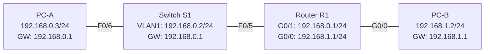
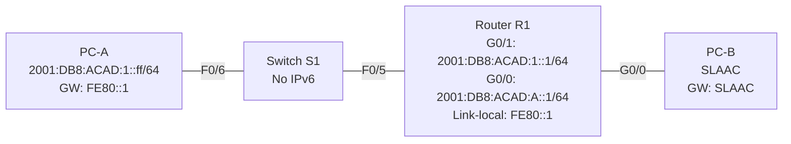

# Lab 2 — IPv4 and IPv6 LAN, Router and Switch Configuration

**Topics:** IPv4 Subnetting · Cisco IOS Basic Configuration · Switch Config via Console · Router Interfaces · IPv6 SLAAC · IPv6 Unicast Routing

---

## Topology

### Task 1 — Switch and Router Network



### Task 2 — IPv6 Addressing



---

## Addressing Tables

### Task 1 — IPv4 (from Homework Topology A, Subnet A = /24, Subnet B = /24)

| Device | Interface | IP Address   | Subnet Mask   | Default Gateway |
|--------|-----------|-------------|---------------|-----------------|
| R1     | G0/0      | 192.168.1.1  | 255.255.255.0 | N/A             |
| R1     | G0/1      | 192.168.0.1  | 255.255.255.0 | N/A             |
| S1     | VLAN 1    | 192.168.0.2  | 255.255.255.0 | 192.168.0.1     |
| PC-A   | NIC       | 192.168.0.3  | 255.255.255.0 | 192.168.0.1     |
| PC-B   | NIC       | 192.168.1.2  | 255.255.255.0 | 192.168.1.1     |

### Task 2 — IPv6

| Device | Interface | IPv6 Address        | Prefix | Default Gateway |
|--------|-----------|---------------------|--------|-----------------|
| R1     | G0/0      | 2001:DB8:ACAD:A::1  | /64    | N/A             |
| R1     | G0/1      | 2001:DB8:ACAD:1::1  | /64    | N/A             |
| S1     | VLAN 1    | N/A                 | N/A    | N/A             |
| PC-A   | NIC       | 2001:DB8:ACAD:1::ff | /64    | FE80::1         |
| PC-B   | NIC       | SLAAC               | SLAAC  | SLAAC           |

---

## Lab Preparation — Subnetting Solutions

### Topology A — 192.168.0.0/16 address space

> Total IPs needed = hosts + 2 (network + broadcast)

| Subnet | Hosts | Mask | Subnet Address | First Host | Last Host | Broadcast |
|--------|-------|------|----------------|------------|-----------|-----------|
| A | 208 | /24 (255.255.255.0) | 192.168.0.0/24 | 192.168.0.1 | 192.168.0.254 | 192.168.0.255 |
| B | 98  | /25 (255.255.255.128) | 192.168.1.0/25 | 192.168.1.1 | 192.168.1.126 | 192.168.1.127 |

### Topology B — 172.16.0.0/24 address space

| Subnet | Hosts | Mask | Subnet Address | First Host | Last Host | Broadcast |
|--------|-------|------|----------------|------------|-----------|-----------|
| PC-A + PC-B | 48 | /26 (255.255.255.192) | 172.16.0.0/26 | 172.16.0.1 | 172.16.0.62 | 172.16.0.63 |
| R1–R2 link | 0 | /30 (255.255.255.252) | 172.16.0.64/30 | 172.16.0.65 | 172.16.0.66 | 172.16.0.67 |

### IPv6 Addressing

- **Global unicast:** `2001:638:402:1303::10/64`
- **Link-local unicast:** `FE80::10` (manually assigned) or EUI-64 derived

**SLAAC EUI-64 for MAC `3c:a6:2f:48:24:3a`:**
1. Split MAC in half: `3c:a6:2f` | `48:24:3a`
2. Insert `FF:FE`: `3c:a6:2f:FF:FE:48:24:3a`
3. Flip 7th bit of first byte: `3c` → `3e` (bit 1 flipped: 0x3c = 0011 1100 → 0x3e = 0011 1110)
4. EUI-64 Interface ID: `3e:a6:2f:ff:fe:48:24:3a`
5. Full link-local: **`FE80::3ea6:2fff:fe48:243a`**

---

## IOS Configuration Reference

### Basic Switch/Router Commands

```
Router> enable
Router# configure terminal
Router(config)# hostname R1
R1(config)# no ip domain-lookup
R1(config)# enable secret class
R1(config)# service password-encryption
R1(config)# banner motd # Unauthorized access is prohibited. #

! Console password
R1(config)# line console 0
R1(config-line)# password cisco
R1(config-line)# login
R1(config-line)# logging synchronous
R1(config-line)# exit

! VTY (Telnet) password
R1(config)# line vty 0 4
R1(config-line)# password cisco
R1(config-line)# login
R1(config-line)# exit

! Save
R1(config)# end
R1# copy running-config startup-config
```

---

## Configs

See `configs/` folder:

| File | Device |
|------|--------|
| `R1.txt` | Router R1 — full IOS config (IPv4 + IPv6) |
| `S1.txt` | Switch S1 — full IOS config |
| `PC-A.txt` | PC-A host commands |
| `PC-B.txt` | PC-B host commands |

---

## Key Observations

- **Why does ping PC-A → PC-B fail before router config?** PC-A (192.168.0.x) and PC-B (192.168.1.x) are in different subnets. Without R1's interfaces configured and active, there is no route between the subnets.
- **Why does ping succeed after router config?** R1 has directly connected routes for both subnets and forwards packets between them.
- **IPv6 SLAAC on PC-B:** PC-B receives the Global Routing Prefix and Subnet ID from R1's Router Advertisement (RA) messages sent to the `FF02::1` (all-nodes) multicast group after `ipv6 unicast-routing` is enabled and R1 joins `FF02::2` (all-routers multicast).
- **Same link-local FE80::1 on both R1 interfaces:** Allowed because link-local addresses are only significant within their local link; they never cross a router.
