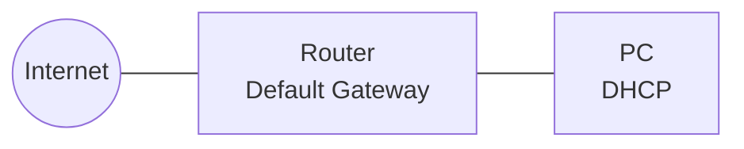
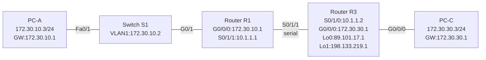

# Lab 3 — TCP/UDP/DNS Analysis, IPv4 Static Routes, SSH Security

**Topics:** TCP 3-Way Handshake · UDP/DNS Wireshark Analysis · IPv4 Subnetting & Summary Routes · Static/Default Routes · SSH Configuration · Device Security Hardening

---

## Topology

### Task 1 — Internet Access (TCP/UDP/DNS Analysis)



### Task 2 & 3 — Static Routes + SSH



---

## Addressing Table — Tasks 2 & 3

| Device | Interface | IP Address     | Subnet Mask     | Default Gateway |
|--------|-----------|----------------|-----------------|-----------------|
| R1     | G0/0/0    | 172.30.10.1    | 255.255.255.0   | N/A             |
| R1     | S0/1/1    | 10.1.1.1       | 255.255.255.252 | N/A             |
| S1     | VLAN1     | 172.30.10.2    | 255.255.255.0   | 172.30.10.1     |
| R3     | G0/0/0    | 172.30.30.1    | 255.255.255.0   | N/A             |
| R3     | S0/1/0    | 10.1.1.2       | 255.255.255.252 | N/A             |
| R3     | Lo0       | 89.101.17.1    | 255.255.255.224 | N/A             |
| R3     | Lo1       | 198.133.219.1  | 255.255.255.0   | N/A             |
| PC-A   | NIC       | 172.30.10.3    | 255.255.255.0   | 172.30.10.1     |
| PC-C   | NIC       | 172.30.30.3    | 255.255.255.0   | 172.30.30.1     |

---

## Lab Preparation — Key Answers

### Part 2: IPv4 Subnetting

#### Topology A — 10.10.10.0/24

Network has: 3 LAN subnets (S1: 10 hosts, S2: 27 hosts, S3: 48 hosts) + 3 inter-router /30 links = **6 subnets total**

| Subnet | Hosts | Mask | Subnet Address | First Host | Last Host | Broadcast |
|--------|-------|------|----------------|------------|-----------|-----------|
| S3 (48h) | 48 | /26 (255.255.255.192) | 10.10.10.0/26 | 10.10.10.1 | 10.10.10.62 | 10.10.10.63 |
| S2 (27h) | 27 | /27 (255.255.255.224) | 10.10.10.64/27 | 10.10.10.65 | 10.10.10.94 | 10.10.10.95 |
| S1 (10h) | 10 | /28 (255.255.255.240) | 10.10.10.96/28 | 10.10.10.97 | 10.10.10.110 | 10.10.10.111 |
| R1-R2 | 0 | /30 (255.255.255.252) | 10.10.10.112/30 | 10.10.10.113 | 10.10.10.114 | 10.10.10.115 |
| R1-R3 | 0 | /30 | 10.10.10.116/30 | 10.10.10.117 | 10.10.10.118 | 10.10.10.119 |
| R2-R3 | 0 | /30 | 10.10.10.120/30 | 10.10.10.121 | 10.10.10.122 | 10.10.10.123 |

#### Inter-router link mask: /30 (255.255.255.252) — 2 usable host addresses, sufficient for 2 router interfaces.

#### Topology B — 192.168.100.0/24 (60-host subnets)

2^6 = 64 addresses → mask /26 (255.255.255.192), 62 usable hosts

| Subnet | Subnet Address | First Host | Last Host | Broadcast |
|--------|----------------|------------|-----------|-----------|
| 1 | 192.168.100.0/26 | 192.168.100.1 | 192.168.100.62 | 192.168.100.63 |
| 2 | 192.168.100.64/26 | 192.168.100.65 | 192.168.100.126 | 192.168.100.127 |
| 3 (1st Floor) | 192.168.100.128/26 | 192.168.100.129 | 192.168.100.190 | 192.168.100.191 |
| 4 | 192.168.100.192/26 | 192.168.100.193 | 192.168.100.254 | 192.168.100.255 |

Starting from subnet 4 (192.168.100.192), further subdivide into /27 (28-host) subnets:

| Subnet | Subnet Address | First Host | Last Host | Broadcast |
|--------|----------------|------------|-----------|-----------|
| 1 | 192.168.100.192/27 | 192.168.100.193 | 192.168.100.222 | 192.168.100.223 |
| 2 (2nd Floor) | 192.168.100.224/27 | 192.168.100.225 | 192.168.100.254 | 192.168.100.255 |

**Device addressing (Table 2):**

| Device | Interface | IP Address | Subnet Mask | Default Gateway |
|--------|-----------|------------|-------------|-----------------|
| R1 | G0/0 | 192.168.100.190 | 255.255.255.192 | N/A |
| R1 | G0/1 | 192.168.100.254 | 255.255.255.224 | N/A |
| S1 | VLAN1 | 192.168.100.253 | 255.255.255.224 | 192.168.100.254 |
| PC-A | NIC | 192.168.100.225 | 255.255.255.224 | 192.168.100.254 |
| PC-B | NIC | 192.168.100.129 | 255.255.255.192 | 192.168.100.190 |

### Part 3: Summary Routes

#### HQ LAN1 (192.168.64.0/23) + HQ LAN2 (192.168.66.0/23)

```
192.168.64.0 = 11000000.10101000.01000000.00000000
192.168.66.0 = 11000000.10101000.01000010.00000000
Matching bits: 22
Summary: 192.168.64.0/22  (255.255.252.0)
```

#### EAST LAN1 (192.168.68.0/24) + EAST LAN2 (192.168.69.0/24)

```
192.168.68.0 = 11000000.10101000.01000100.00000000
192.168.69.0 = 11000000.10101000.01000101.00000000
Matching bits: 23
Summary: 192.168.68.0/23  (255.255.254.0)
```

#### WEST LAN1 (192.168.70.0/25) + WEST LAN2 (192.168.70.128/25)

```
192.168.70.0   = 11000000.10101000.01000110.00000000
192.168.70.128 = 11000000.10101000.01000110.10000000
Matching bits: 24
Summary: 192.168.70.0/24  (255.255.255.0)
```

#### All sites (HQ/EAST/WEST) summary for ISP

```
192.168.64.0/22 (HQ)
192.168.68.0/23 (EAST)
192.168.70.0/24 (WEST)
All match: 192.168.64.0 – 192.168.71.255
Matching bits: 21
Summary for ISP: 192.168.64.0/21  (255.255.248.0)
```

### Part 5: TCP, UDP, DNS

- **TCP 3-Way Handshake messages:** SYN → SYN-ACK → ACK
- **DNS UDP Port:** 53
- **Wireshark TCP filter:** `tcp`
- **Wireshark individual TCP session filter:** `tcp.stream eq <n>` (where n = stream number from Wireshark)

---

## Static Route Types

| Type | Command | When to Use |
|------|---------|-------------|
| Recursive (next-hop) | `ip route <network> <mask> <next-hop-ip>` | When next-hop is known |
| Directly connected | `ip route <network> <mask> <exit-interface>` | Point-to-point serial links |
| Default route | `ip route 0.0.0.0 0.0.0.0 <next-hop or interface>` | Stub networks / internet edge |

---

## Configs

| File | Device |
|------|--------|
| `R1.txt` | Router R1 — basic config + IPv4 interfaces + static routes + SSH |
| `R3.txt` | Router R3 — basic config + IPv4 interfaces + loopbacks + static/default routes |
| `S1.txt` | Switch S1 — basic config + SVI + SSH + port security |
| `PC-A.txt` | PC-A host commands |
| `PC-C.txt` | PC-C host commands |

---

## SSH Quick Reference

```
! 1. Set domain name (required for RSA key generation)
ip domain-name ccna-lab.com

! 2. Generate RSA key (1024 bits minimum for SSH v2)
crypto key generate rsa
! → enter: 1024

! 3. Create local user with privilege 15
username admin privilege 15 secret adminpass

! 4. Restrict VTY to SSH only, use local database
line vty 0 4
 transport input ssh
 login local
 exit

! 5. (Optional) Force SSH version 2
ip ssh version 2
```

**Default SSH TCP port:** 22

---

## Security Hardening Summary

```
! Strong password minimum length
security passwords min-length 10

! Change enable password to meet complexity
enable secret Enablep@55

! Idle timeout (5 min) on console and VTY
line console 0
 exec-timeout 5 0
line vty 0 4
 exec-timeout 5 0

! Block brute-force: 2 failures in 120s → block for 60s
login block-for 60 attempts 2 within 120
```
